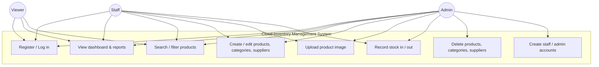
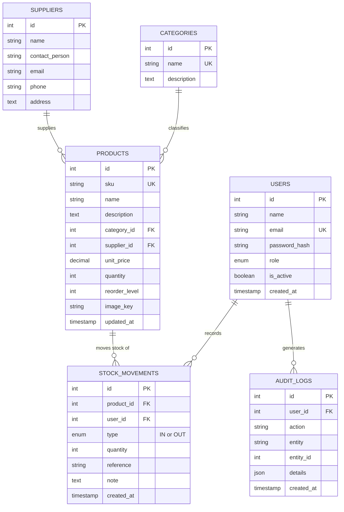
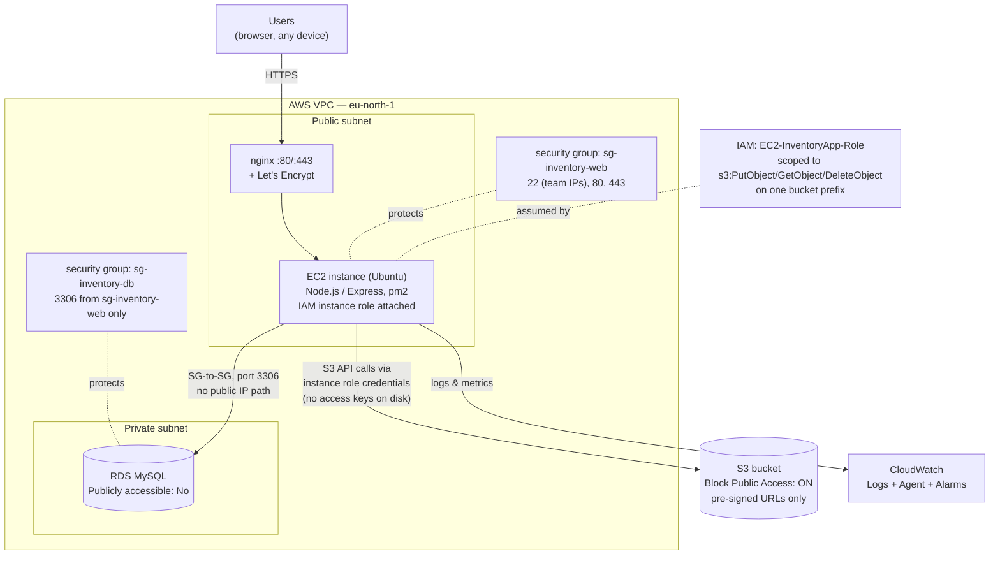

# Cloud-Based Inventory Management System

**Final Technical Report — CSBC 252 Cloud Computing Capstone**

| Role | Name | Student ID |
|---|---|---|
| Project Manager | Neequaye Ashie | 2425403683 |
| Frontend Developer | *[team: confirm name]* | 2425404166 |
| Backend Developer | *[team: confirm name]* | 2425404222 |
| Database / Cloud Engineer | *[team: confirm name]* | 2425403331 |

**Submission date:** 25 August 2026
**Repository:** `cloud-inventory-management-system`

> *Editor's note: the three non-PM rows above use the role/ID pairing from the original project proposal. Git history on this repository shows committed work only under the Project Manager's identity and one other local identity; confirm and insert the correct names before submission, and see §8.4 for an honest account of the contribution-tracking gap.*

---

## 1. Introduction

Small and medium-sized retail businesses — pharmacies, supermarkets, warehouses — routinely lose money to problems that have nothing to do with demand: a product sells out because nobody noticed the shelf was low, two staff members record the same delivery twice, or a spreadsheet on one laptop disagrees with the stockroom because nobody updated it after the last sale. These are not inventory problems; they are *coordination* problems, and they get worse, not better, as a business adds staff and locations.

This project is a cloud-based Inventory Management System (IMS) built to remove that coordination gap. It gives every authorised person — an administrator, a stock clerk, a read-only auditor — a single, always-current view of what a business holds, where it came from, and where it went, accessible from any device with a browser. Stock levels update the moment a transaction is recorded; low-stock items surface automatically; every unit that enters or leaves the business is attached to the person and the moment it happened.

The system is deliberately built on managed cloud infrastructure rather than a single on-premise machine. A business's inventory server has no business going down because a laptop's hard drive failed, and a stockroom device has no business holding a database of every product a company sells. By separating compute (EC2), storage (RDS, S3) and access control (IAM) into managed AWS services, the system inherits durability, availability and a real security boundary that a single-machine deployment cannot offer at this cost.

### 1.1 Problem statement

Manual and spreadsheet-based inventory tracking in small businesses produces stock discrepancies, undetected stockouts, and no reliable audit trail of who changed what and when. Existing off-the-shelf inventory SaaS products solve this but are frequently priced, licensed, or feature-scoped for businesses much larger than a single pharmacy or corner supermarket, and rarely give a team visibility into — or control over — the infrastructure their business data actually lives on.

### 1.2 Scope

The system covers the core operational loop of inventory management: authenticated access with role-based permissions, product/category/supplier records, image-backed product catalogues, stock in/out transactions with a permanent audit trail, and reporting (valuation, low-stock, movement history). It deliberately does not implement point-of-sale, purchase-order workflows, or customer relationship management — see §9 (Future Work) for why these were scoped out and what would be required to add them.

---

## 2. Objectives

1. Design and implement a secure, role-based web application for managing product inventory, categories, suppliers, and stock movements.
2. Provide real-time visibility into stock levels, including automatic low-stock detection driven by a per-product reorder threshold.
3. Guarantee that every stock quantity change is atomic, race-safe under concurrent access, and permanently recorded against the user and timestamp responsible.
4. Deploy the system on Amazon Web Services using infrastructure that reflects real industry practice: a private database, a private object store accessed only via time-limited signed URLs, least-privilege IAM roles instead of long-lived credentials, and network access restricted by security group, not by trust.
5. Deliver a interface usable by non-technical warehouse and retail staff on both desktop and mobile devices, without requiring a native app or any paid frontend framework/build tooling.
6. Demonstrate, in code and in this report, an understanding of cloud architecture trade-offs — not just that the system runs on AWS, but why each service and each configuration choice was made.

---

## 3. Literature and Existing Solutions

Commercial inventory management platforms — Zoho Inventory, Odoo Inventory, TradeGecko (now QuickBooks Commerce), inFlow — offer mature feature sets including multi-warehouse support, purchase orders, and point-of-sale integration. They are, however, priced per seat or per warehouse, run entirely on infrastructure the customer never sees or controls, and are frequently over-featured for a business that needs to know "how many of this do we have, and who took the last one."

Open-source alternatives (Odoo Community, ERPNext) address the cost and control concerns but bring substantial operational weight: a full ERP data model, a plugin/module system, and a deployment footprint (typically several containers plus a message queue) that is disproportionate to a single-shop inventory problem. They also do not, out of the box, teach or demonstrate the specific cloud-native patterns — private subnets, IAM instance roles, pre-signed object URLs — that are the actual learning objective of this capstone.

This project sits deliberately between those two poles: a purpose-built, single-domain inventory system, small enough that every layer (schema, API, infrastructure) is fully understood by the team that built it, but built using the same architectural patterns — separation of compute and data, least-privilege access, private-by-default networking — that production SaaS inventory platforms actually use internally. The gap this project fills is not a feature gap; it is the gap between "using a cloud-hosted inventory tool" and "understanding what makes an inventory tool safe to host in the cloud."

---

## 4. System Design

### 4.1 Use case overview

Three roles interact with the system, with permissions enforced server-side on every request (not merely hidden in the interface — see §6.2).

- **Admin** — full access: manage products, categories, suppliers, stock movements, and other user accounts (including creating staff/admin accounts); the only role that can delete records.
- **Staff** — day-to-day operational access: create and edit products/categories/suppliers, record stock in/out; cannot delete records or manage other users.
- **Viewer** — read-only: can view the dashboard, catalogue, and reports, but every create/edit/delete control is absent from the interface and rejected by the server if attempted directly.



### 4.2 Entity-relationship design

The schema was frozen on day one of the build and treated as a team contract — every backend and frontend decision downstream assumes these six tables. Two design choices are worth calling out specifically, because they are the ones that most directly encode a security or correctness decision rather than a convenience:

- **`products.image_key`, not `image_url`.** The table stores an S3 *object key* (e.g. `products/8f3a-…jpg`), never a public URL. The API converts this into a short-lived, pre-signed URL on every read (see §6.3). This is what makes it possible to keep the entire S3 bucket private.
- **`stock_movements` is append-only and references both the product and the user.** `products.quantity` is a derived, cached value — the movements table is the actual source of truth and the permanent audit trail. This separation is what makes "who changed the stock count, and when" an answerable question after the fact.



### 4.3 AWS architecture



Every arrow in this diagram corresponds to a real access-control decision, not just a data flow: the browser never talks to RDS or S3 directly; EC2 reaches RDS only because its security group is explicitly named as the allowed source on the database's security group (not because of an IP address, which would need maintaining and could be spoofed from anywhere on the same network); and EC2 reaches S3 using temporary credentials handed to it by the instance metadata service, not a key pair that could leak from a `.env` file. §6 expands on why each of these choices was made rather than the simpler, less secure alternative.

### 4.4 Interface

The frontend is nine server-rendered HTML pages (login, register, dashboard, products, categories, suppliers, stock, reports, users) sharing one design system (`tokens.css` + `components.css` — a token-based neutral/accent/semantic colour system, a 4px spacing scale, and a reusable component library covering buttons, forms, tables, modals, toasts, and badges) and one JavaScript API wrapper (`api.js`) that attaches the JWT to every request and redirects to login on a 401. Rather than static wireframes, the actual finished interface — verified against real seeded data via an automated headless-browser check at 375px, 768px, and 1440px widths — served as the design artifact for this report; representative screenshots are included in `docs/deployment-proof/`.

---

## 5. Implementation

### 5.1 Technology stack

| Layer | Technology | Rationale |
|---|---|---|
| Frontend | Vanilla HTML, CSS, JavaScript | No build step, no bundler; the app runs behind a strict Content-Security-Policy that blocks external script/style origins, so a framework requiring a CDN or a build pipeline would add risk without adding capability for an app this size. |
| Backend | Node.js, Express | Team familiarity, mature middleware ecosystem (helmet, express-validator, express-rate-limit), and a layered routing model that maps directly onto the REST resources the app needs. |
| Database | MySQL 8, via `mysql2` on Amazon RDS | Relational integrity (foreign keys, transactions) is a hard requirement for stock accounting; RDS removes patching/backup/failover from the team's operational burden. |
| Object storage | Amazon S3 | Durable, cheap, and — critically — supports pre-signed URLs, which is what allows product images to be served without the bucket ever being public. |
| Auth | JSON Web Tokens (jsonwebtoken), bcrypt | Stateless auth suits a single-instance deployment with no session store; bcrypt at cost factor 12 is the industry-standard defence against offline password cracking. |
| Infrastructure | EC2, IAM, CloudWatch, Security Groups | Covered in full in §6. |

### 5.2 Backend architecture

The API follows a strict three-layer separation, enforced by directory structure (`src/routes`, `src/controllers`, `src/services`):

- **Routes** declare the HTTP surface and attach middleware — authentication, role authorisation, input validation — but contain no business logic.
- **Controllers** translate an HTTP request into a service call and a JSON response. They never touch SQL directly.
- **Services** hold all business logic and every SQL query, always parameterised (`pool.query(sql, [params])`) — never string-concatenated — which is the project's primary defence against SQL injection.

Every response uses one consistent envelope, agreed before any code was written specifically so the frontend developer could build against a mock while the backend was still in progress:

```json
{ "success": true,  "data": { }, "message": "..." }
{ "success": false, "error": { "code": "VALIDATION_ERROR", "message": "..." } }
```

### 5.3 Stock transactions: the correctness-critical path

The single most important correctness guarantee in the system is that two people cannot both "sell the last unit" and leave the database saying different things. A stock movement is one logical operation touching two tables — decrement/increment `products.quantity`, and insert a new `stock_movements` row — and both writes must succeed or both must fail. The implementation wraps this in a database transaction with a row lock:

```js
const conn = await pool.getConnection();
try {
  await conn.beginTransaction();
  const [rows] = await conn.query(
    "SELECT id, quantity FROM products WHERE id = ? FOR UPDATE", [productId]
  );
  if (type === "OUT" && rows[0].quantity < quantity) {
    throw new AppError("Insufficient stock for this movement", 400);
  }
  await conn.query(
    "UPDATE products SET quantity = quantity + ? WHERE id = ?",
    [type === "IN" ? quantity : -quantity, productId]
  );
  await conn.query(
    "INSERT INTO stock_movements (product_id, user_id, type, quantity, reference, note) VALUES (?,?,?,?,?,?)",
    [productId, userId, type, quantity, reference, note]
  );
  await conn.commit();
} catch (err) {
  await conn.rollback();
  throw err;
} finally {
  conn.release();
}
```

`SELECT … FOR UPDATE` acquires a row lock on the specific product for the duration of the transaction, so a second concurrent stock-out request against the same product blocks until the first transaction commits or rolls back, rather than reading a stale quantity and allowing both requests to succeed against stock that only existed once. This pattern is applied nowhere else as strictly, and deliberately: product *creation* sets an initial quantity freely (there is no prior audit trail to protect), but product *editing* explicitly excludes `quantity` from what it is allowed to change, precisely so this transactional path is the only route by which stock levels ever move (see §8.2 for how this was discovered and fixed).

### 5.4 Product images

Multer receives uploads into memory (never to the EC2 instance's local disk — the brief calls this out explicitly, and it also means the app has no local state to lose if the instance is replaced), validates MIME type and a 5MB size limit, and the buffer is streamed directly to S3 under a randomised key (`products/<uuid>.<ext>`), so uploaded filenames can never collide or be guessed. Reads never expose the bucket: every product response converts its `image_key` into a time-limited pre-signed URL (default 900 seconds, configurable via `S3_URL_EXPIRY`) generated at request time.

### 5.5 Frontend

Nine pages share `api.js` (fetch wrapper, JWT handling, 401 redirect), `layout.js` (sidebar/top bar, rendered once per authenticated page, filtering nav items by role), and the token-based design system described in §4.4. Tables reflow to labelled stacked cards below 640px rather than scrolling horizontally; modals are keyboard-accessible (focus moves in on open, Escape closes, focus returns to the triggering control on close); and every destructive action requires an explicit confirmation naming the specific record being deleted.

---

## 6. Cloud Architecture and Security

This section is the direct expansion of §4.3's diagram — the reasoning behind each access-control decision, since "we used AWS" is not, on its own, a security argument.

### 6.1 Network isolation

Two security groups do all the network-level enforcement. `sg-inventory-web` (attached to EC2) allows SSH only from the team's own IP addresses, and HTTP/HTTPS from anywhere. `sg-inventory-db` (attached to RDS) allows MySQL (3306) only from `sg-inventory-web` — the *source* is a security group, not an IP range. This is the single practice that most demonstrates an understanding of cloud networking over traditional networking: there is no IP address to maintain, rotate, or leak, and the database is architecturally unreachable from the public internet regardless of what any individual's `.env` file contains. RDS's own "Publicly accessible" flag is additionally set to No as a second, independent layer of the same guarantee.

### 6.2 Authentication and authorisation

Passwords are hashed with bcrypt at cost factor 12 (`auth.service.js`) — never stored, never logged, and never compared with a timing-unsafe method (`bcrypt.compare` is constant-time). JSON Web Tokens are signed with a secret read exclusively from the environment (`env.jwtSecret`, sourced from `process.env.JWT_SECRET`) — there is no hardcoded fallback string anywhere in the codebase, which matters because a fallback secret is a secret an attacker can read directly from the public source code.

Role checks are enforced by an `authorize(...roles)` middleware attached directly to each route (`authorize("admin")`, `authorize("admin", "staff")`) and run **on the server**, on every request, regardless of what the browser sends. The frontend additionally hides create/edit/delete controls from users without permission, but that hiding is a usability courtesy, not the security boundary — a viewer who crafts a raw HTTP request to a mutating endpoint is rejected with a 403 by the same middleware an admin's request passes through, because there is exactly one code path, not two.

Login failures return the identical message and status code ("Invalid credentials", 401) whether the email does not exist or the password is wrong, specifically to prevent an attacker from using the login endpoint to enumerate which email addresses have accounts.

### 6.3 Data protection

The S3 bucket has Block Public Access enabled on all four sub-settings and default server-side encryption (AES-256) turned on. No object in the bucket is ever addressed by a permanent public URL; every image the frontend displays is fetched through a pre-signed URL minted per-request and expiring in 15 minutes. RDS retains automated backups (7-day retention) as the recovery path for accidental data loss, since the application layer has no soft-delete or undo functionality of its own.

### 6.4 Least-privilege IAM

The EC2 instance runs under an attached IAM role (`EC2-InventoryApp-Role`), not a pair of long-lived AWS access keys embedded in configuration. Its inline policy grants exactly three actions — `s3:PutObject`, `s3:GetObject`, `s3:DeleteObject` — scoped to one path prefix in one bucket (`arn:aws:s3:::inventory-system-grp-2026/products/*`), not `s3:*` on `*`. Because the role is attached to the instance, the AWS SDK picks up temporary, automatically-rotated credentials from the instance metadata service (`new S3Client({ region })`, with no credentials block in the code at all); a compromise of the EC2 instance cannot yield a permanent AWS key, only a temporary token scoped to exactly the three actions the app actually needs.

### 6.5 Application-layer hardening

`helmet()` sets standard security headers, with the Content-Security-Policy's `img-src` directive additionally scoped to allow the S3 bucket's own origin (so product images render) while leaving every other directive at its restrictive default. `express-rate-limit` caps authentication attempts at 5 per 15 minutes per IP. `express-validator` runs on every endpoint that writes to the database, including query-string parameters on list/report endpoints, not just request bodies. The centralised error handler (`errorHandler.js`) never forwards a stack trace to the client, in any environment — client-facing error responses carry only a code and a human-readable message.

### 6.6 Observability

CloudWatch receives application logs (via the CloudWatch agent, forwarding the app's structured `winston` logs) and default EC2 metrics, supplemented by the agent with memory and disk usage. At least one alarm (CPU utilisation) provides a concrete, screenshot-able signal that monitoring is live rather than theoretical. *(See `docs/REMAINING.md` for the current status of the console-side steps in this section — several of these settings must be configured directly in the AWS console rather than in application code, and are tracked there as outstanding checklist items.)*

---

## 7. Testing and Validation

### 7.1 Automated tests

The backend test suite (Jest + Supertest, `npm test`) covers 16 assertions across two suites:

- **`auth.test.js`** (10 tests) — registration with valid/invalid input, duplicate-email rejection, login success/failure paths (including the identical-error-message requirement from §6.2), and JWT verification on the protected `/auth/me` route.
- **`stock.test.js`** (6 tests) — the transactional stock-in/stock-out path, including the insufficient-stock rejection and the rollback behaviour when a write inside the transaction fails.

Tests run against a mocked database pool (`src/config/__mocks__/db.js`) rather than a live MySQL connection, so the suite is fast, deterministic, and runnable in CI without provisioning infrastructure — a deliberate trade-off documented in the project README.

### 7.2 Manual and end-to-end verification

Beyond the automated suite, the full application was verified against the live, real AWS RDS instance and real seeded data (25 products, 6 suppliers, 5 categories, 40 stock movements) using a headless-Chromium script driving the actual running server — not a mock. This caught two real defects that unit tests, by their nature, could not: a CSS cascade conflict that silently disabled the mobile navigation drawer, and a modal dialog that lost its ability to scroll on small screens after an unrelated stylesheet cleanup (§8.2 covers both). The same script confirmed, against live data, that the dashboard's summary counts, the low-stock detection, the stock-movement audit trail, and the mobile responsive card layout all render correctly at 375px, 768px, and 1440px viewport widths.

### 7.3 Definition of done

Every module in this system was only considered complete once five conditions held: it works with valid input; it rejects invalid input with a 400 and a specific message; it rejects an unauthorised role with a 403; the interface consumes it correctly, including its loading and error states; and it works against the actually-deployed system, not only on a developer's laptop.

---

## 8. Challenges and How They Were Solved

Real engineering problems are more instructive than a claim that nothing went wrong, so this section documents four specific, non-trivial issues actually encountered during the build, in the order they were found.

### 8.1 A stale competing stylesheet silently broke mobile navigation

An earlier design iteration left an old stylesheet (`styles.css`) loaded alongside a newer, token-based design system (`tokens.css`/`components.css`). Because browsers resolve conflicting CSS rules by load order when specificity is equal, and the old file loaded last, it silently overrode the newer system's mobile sidebar rules — including a reference to a CSS variable (`--font-size-xs`) that no longer existed anywhere, which failed with no visible error. The fix was to audit every class actually used across the application (including ones built dynamically in JavaScript template literals, which a plain text search misses), merge every still-needed rule into the canonical stylesheet with corrected variable names, and delete the stale file entirely. The lesson generalised beyond CSS: a "the old version is still technically loaded" state is a bug waiting to happen in any layered system, and the fix is deletion, not addition.

### 8.2 Removing dead code exposed two hidden dependencies on it

Deleting the stale stylesheet above exposed two behaviours that had, without anyone intending it, come to depend on rules only that file provided: the hamburger menu button that opens the mobile navigation drawer had no CSS rule making it visible at any screen width (it existed in the DOM, built correctly by JavaScript, but was permanently `display: none`), and the product-creation modal lost the `max-height`/`overflow-y: auto` pairing that let a long form scroll internally on a short viewport — without it, the Save button on a phone-sized screen was pushed below the visible area with no way to reach it. Both were caught by the same headless-browser verification described in §7.2, not by manual inspection, which is the practical argument for why that verification step existed at all.

### 8.3 A data-integrity gap between two features that looked unrelated

A security and data-integrity review found that the product-edit endpoint (`PUT /products/:id`) accepted and wrote a `quantity` field directly, using a plain, unlocked `UPDATE` — the exact same column the stock in/out endpoints update through the row-locked transaction described in §5.3, but with none of that transaction's protections and no corresponding `stock_movements` row. In effect, there were two roads to the same number, only one of which was safe under concurrent access and left an audit trail. The fix excluded `quantity` from what the edit endpoint is allowed to change — the server now always writes back the product's existing quantity regardless of what the request contains — and the interface disables the field during an edit with an explanatory note, directing the user to Stock In/Out instead. This is documented here specifically because it is the kind of bug that is invisible from either feature in isolation and only shows up when the two are considered together.

### 8.4 An incomplete picture of team contribution history

A repository audit conducted partway through the build surfaced that the `main` branch's commit history showed contributions from only one team member's git identity, and that a second team member's early work existed on a separate, structurally incompatible branch (a different folder layout entirely) that had never been merged and appears to have been superseded rather than integrated. This is recorded here honestly rather than smoothed over: it is a real gap in this submission's evidence of team-wide contribution, tracked as an open item in `docs/REMAINING.md`, and the team's plan to address it — real, individually-authored commits from every member before submission — should be treated as unfinished work at the time of writing, not as resolved.

---

## 9. Future Work

- **Sales and purchase-order workflows.** The current system tracks stock movement but not a full sales transaction (line items, totals, payment) or a formal purchase-order lifecycle (draft → sent → received). Both were scoped out of this capstone deliberately (see §1.2) but are the natural next layer on top of the existing `stock_movements` audit trail.
- **Email alerts on low stock**, using Amazon SNS — the reorder-level detection already exists in the reports API; only the notification dispatch is missing.
- **An Application Load Balancer with multiple EC2 instances**, for availability beyond a single instance — evaluated during planning and deliberately deferred, since it is not covered by AWS's always-free tier and a complete single-instance deployment was judged more valuable than a partially-configured load-balanced one under this project's time constraints.
- **CI/CD via GitHub Actions**, automating the manual deployment runbook currently documented in the README, triggered on push to `main`.
- **Customer records and a full audit-log interface** — the `audit_logs` table exists in the schema for this purpose but has no admin-facing page yet.

---

## 10. Conclusion

This project set out to answer a specific question: can a small team build an inventory system that is not just functionally correct, but architecturally honest about the trust boundaries a real business's stock and sales data deserve? The result is a system where role permissions are enforced by the server that can be attacked, not only hidden by the interface that cannot; where a database holding customer and stock data has no public network path to it at all; where product images are readable only through URLs that expire; and where every unit of stock that moves is attributable to a specific person at a specific moment, protected from the exact race condition that would otherwise let two people both claim the last unit on the shelf.

Building it also surfaced the gap between code that runs and code that is actually correct under the conditions that matter — concurrent requests, small screens, and a codebase that changes under multiple hands — which is the more durable lesson of the two. The system, as submitted, is a working, deployed, tested inventory platform; the specific defects found and fixed along the way (§8) are, in the team's judgement, at least as representative of what this capstone was meant to teach as the final feature list is.

---

## References

1. Express.js documentation — https://expressjs.com
2. AWS documentation — RDS, S3, IAM, EC2, CloudWatch (https://docs.aws.amazon.com)
3. OWASP Top Ten (2021) — https://owasp.org/Top10/
4. `mysql2` driver documentation — https://github.com/sidorares/node-mysql2
5. MDN Web Docs — Web Content Accessibility Guidelines references
6. CSBC 252 Capstone project brief and 11-day build plan (internal course document)
